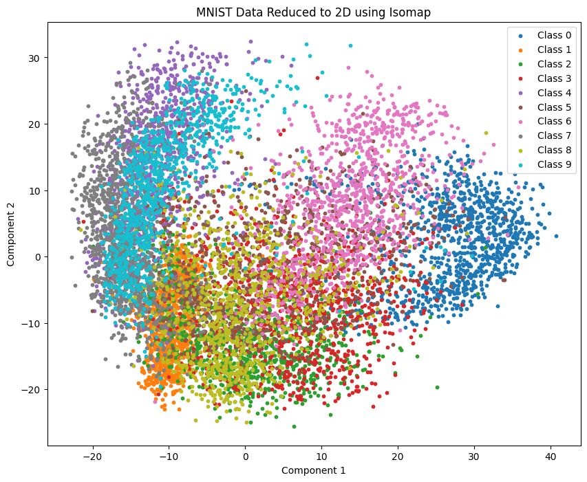
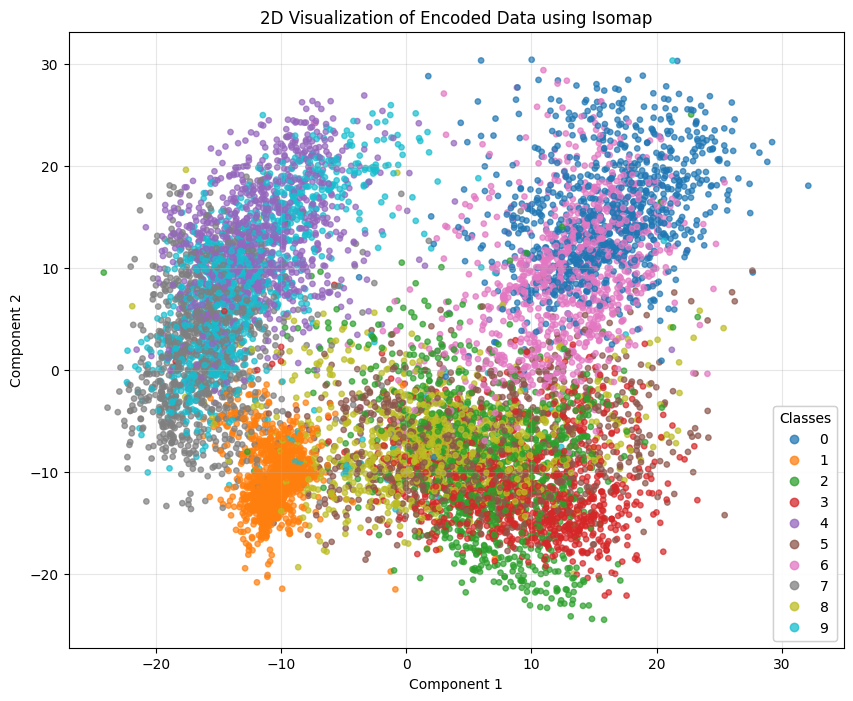
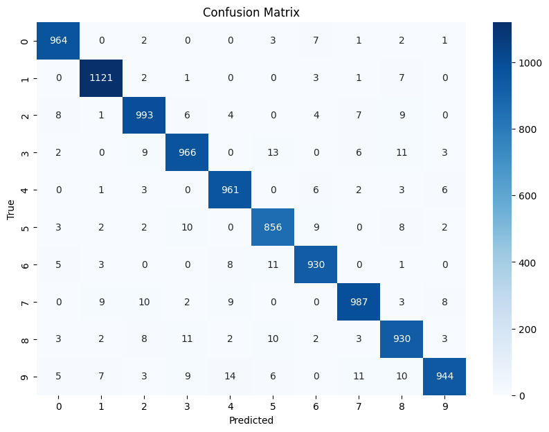

# Encoder and Decoder for MNIST Dataset

## Overview
This project implements an autoencoder architecture to compress and reconstruct handwritten digits from the MNIST dataset. The primary objective is to explore dimensionality reduction and data reconstruction techniques while maintaining the integrity of the original images.

The project includes:
- An encoder that compresses MNIST images into a lower-dimensional latent space.
- A decoder that reconstructs the original images from the latent representations.
- Training and evaluation metrics to assess reconstruction quality.
- A classification model trained on the latent representations for further analysis.

## Features
- **Encoder**: Reduces the dimensionality of MNIST images, extracting key features in the latent space.
- **Decoder**: Reconstructs the original MNIST images from the encoded features.
- **Training Pipeline**: Implements training with loss minimization for reconstruction using Mean Squared Error (MSE) or Binary Cross-Entropy (BCE).
- **Evaluation Metrics**: Calculates reconstruction accuracy using metrics such as PSNR and SSIM.
- **Classification on Latent Space**: Trains a classification model on the latent representations and evaluates its performance using classification reports.

## Getting Started

### Prerequisites
To run this project, ensure the following are installed:
- Python >= 3.8
- PyTorch >= 1.9
- NumPy
- Matplotlib
- torchvision

### Installation
1. Clone the repository:
   ```bash
   git clone https://github.com/pezhman9/MNIST_encoder.git
   ```
2. Navigate to the project directory:
   ```bash
   cd MNIST_encoder
   ```
3. Install the required Python packages:
   ```bash
   pip install -r requirements.txt
   ```

### Usage
1. Run the Jupyter Notebook:
   ```bash
   jupyter notebook mnist.ipynb
   ```
2. Train the autoencoder by executing the training cells in the notebook.
3. Evaluate the reconstruction performance using the evaluation metrics provided.
4. Train a classification model on the latent space and evaluate its performance by generating a classification report.

### Results
- The reconstructed MNIST images are saved in the `outputs/` directory.
- Training and validation loss plots are saved for analysis.
- Classification performance (accuracy, precision, recall, F1-score) is saved in the `outputs/` directory as a classification report.

## Project Structure
```
mnist-autoencoder/
├── mnist.ipynb          # Main Jupyter Notebook for training and evaluation
├── data/                # Contains MNIST dataset (downloaded automatically)
├── outputs/             # Directory for reconstructed images, plots, and classification reports
├── models/              # Saved encoder and decoder models
├── utils.py             # Helper functions for data processing and visualization
├── requirements.txt     # Python dependencies
└── README.md            # Project documentation
```

## How It Works
1. **Data Loading**: Loads MNIST dataset using torchvision.
2. **Model Architecture**:
   - Encoder: A series of convolutional layers with ReLU activations, followed by a latent layer.
   - Decoder: A series of deconvolutional layers to reconstruct the original image.
3. **Training**:
   - Loss Function: Uses MSE or BCE with Logits Loss to minimize reconstruction error.
   - Optimizer: Adam optimizer with a learning rate of 1e-3.
4. **Evaluation**: Computes metrics like PSNR to assess reconstruction quality.
5. **Classification**: Trains a simple classifier (e.g., logistic regression, SVM) on the latent features extracted by the encoder and evaluates its performance using a classification report.

## latetn space
Original images (left) vs. Reconstructed images (right):

<p align="center">
  
  
</p>


<p align="center">
  <b>Confustion matrix </b><br>
  
</p>

Classification Report:
               precision    recall  f1-score   support

           0       0.97      0.98      0.98       980
           1       0.98      0.99      0.98      1135
           2       0.96      0.96      0.96      1032
           3       0.96      0.96      0.96      1010
           4       0.96      0.98      0.97       982
           5       0.95      0.96      0.96       892
           6       0.97      0.97      0.97       958
           7       0.97      0.96      0.96      1028
           8       0.95      0.95      0.95       974
           9       0.98      0.94      0.96      1009

    accuracy                           0.97     10000
    macro avg       0.96      0.96      0.96     10000
    weighted avg       0.97      0.97      0.97     10000


## Future Work
- Experiment with different latent space dimensions.
- Implement variational autoencoders (VAEs) for probabilistic modeling.
- Test on additional datasets for generalization.
- Explore transfer learning techniques using the latent space representations.

## Contributions
Contributions are welcome! Please fork this repository and submit a pull request for any improvements or new features.

## License
This project is licensed under the MIT License. See the LICENSE file for more details.

## Acknowledgments
- [PyTorch Documentation](https://pytorch.org/docs/)
- [MNIST Dataset](http://yann.lecun.com/exdb/mnist/)

